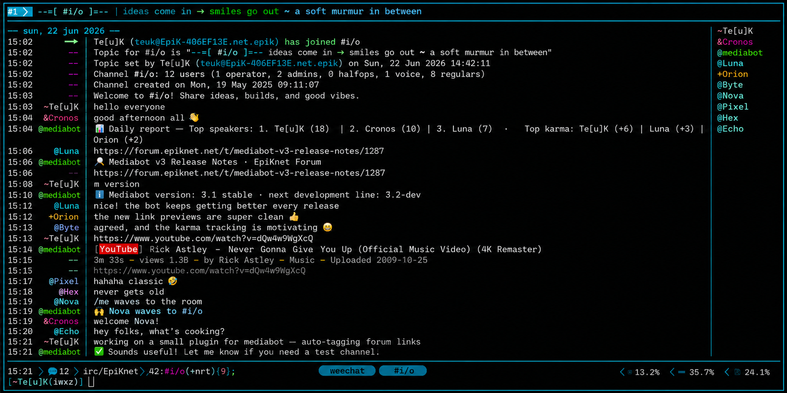

# Mediabot v3

**Mediabot v3** is a multi-purpose IRC bot written in Perl.

It is designed for real IRC operations and long-term use: channel administration, user and hostmask management, public commands, database-backed features, URL/media helpers, radio helpers, antiflood protection, observability, and a dedicated TCP admin interface called **Partyline**.

<p align="center">
  <a href="docs/mediabot.png">
    
  </a>
</p>

<p align="center">
  <em>Illustrated WeeChat-style view of Mediabot v3 running on #i/o. The conversation is fictional.</em>
</p>

---

## Community

**[Report a bug](https://github.com/teuk/mediabot_v3/issues/new?template=bug_report.md) · [Request a feature](https://github.com/teuk/mediabot_v3/issues/new?template=feature_request.md) · [Ask a question](https://github.com/teuk/mediabot_v3/discussions) · [Contribute](CONTRIBUTING.md) · [Get support](SUPPORT.md)**

Live IRC community chat:

* **Network:** EpiKnet
* **Server:** `irc.epiknet.org`
* **Port:** `6697`
* **Encryption:** SSL/TLS
* **Channel:** `#i/o`

Contributions of all sizes are welcome, including code, documentation, tests, plugins, translations, installation feedback, and testing on additional IRC networks.

Use GitHub Issues for reproducible bugs and concrete feature requests. Use GitHub Discussions for installation questions, general support, and ideas that still need discussion.

---

## Documentation first

The README gives the essential path to install and validate Mediabot.

The full documentation lives in the GitHub wiki:

* [Mediabot v3 Wiki](https://github.com/teuk/mediabot_v3/wiki)
* [Installation](https://github.com/teuk/mediabot_v3/wiki/Installation)
* [Configuration](https://github.com/teuk/mediabot_v3/wiki/Configuration)
* [Database model](https://github.com/teuk/mediabot_v3/wiki/Database-model)
* [Public commands](https://github.com/teuk/mediabot_v3/wiki/Public-commands)
* [Private and admin commands](https://github.com/teuk/mediabot_v3/wiki/Private-and-admin-commands)
* [Partyline](https://github.com/teuk/mediabot_v3/wiki/Partyline)
* [Testing](https://github.com/teuk/mediabot_v3/wiki/Testing)
* [Troubleshooting](https://github.com/teuk/mediabot_v3/wiki/Troubleshooting)
* [Local configure wizard reference](docs/CONFIGURE.md)
* [Release and upgrade notes](https://github.com/teuk/mediabot_v3/wiki/Release-and-upgrade-notes)
* [Changelog and 3.3 release notes](CHANGELOG.md)

If something in this README is not enough, go to the wiki. The wiki is the operational reference.

---

## Release status

Mediabot follows a simple versioning rule:

* **odd minor versions** are stable releases;
* **even minor versions** are development / beta lines.

Examples:

```text
3.3      current stable release
3.4dev   next development line
```

Use a stable release if you want a conservative deployment.

Use the Git tree if you want to test or contribute to the next development line.

---

## Key features

Depending on configuration and enabled integrations, Mediabot can provide:

* IRC channel administration;
* user, level, and hostmask management;
* public utility commands;
* private/admin commands;
* URL title handling;
* YouTube, TMDB, media, and radio helpers;
* reminders, notes, polls, karma, trivia, quotes, and other IRC tools;
* channel engagement: `onthisday` history recall (with optional daily digest),
  enriched `seen` and `mood`, a `topquote` hall of fame, and channel `milestone`
  tracking;
* antiflood guards for busy channels;
* netsplit/reconnect hardening;
* Partyline TCP/DCC admin interface;
* Prometheus metrics;
* test harnesses for static and live validation.

---

## Quick install on Debian

The full install guide is here:

* [Installation](https://github.com/teuk/mediabot_v3/wiki/Installation)

This section is only the essential path.

### 1. Install bootstrap packages

As `root`:

```bash
apt update
apt install -y \
  sudo \
  git \
  curl \
  wget \
  jq \
  unzip \
  zip \
  ca-certificates \
  perl \
  build-essential \
  make \
  gcc \
  pkg-config \
  mariadb-server \
  mariadb-client \
  libmariadb-dev

systemctl enable --now mariadb
```

`libmariadb-dev` provides the MariaDB Connector/C headers and `mariadb_config`
needed to compile the CPAN driver. It is a native build dependency, not a Perl
module package.

Do not install `libdbi-perl`, `libdbd-mariadb-perl` or
`libdbd-mysql-perl` for the supported installation path. `./configure` installs
and verifies `DBI`, `DBD::MariaDB` and the remaining Perl modules through CPAN.

Optional but useful:

```bash
apt install -y screen tmux htop lsof net-tools iproute2 dnsutils rsync chromium
```

### 2. Create the dedicated user

Mediabot must not run as root.

```bash
adduser mediabot
su - mediabot
```

Expected:

```bash
whoami
pwd
```

```text
mediabot
/home/mediabot
```

### 3. Get Mediabot

For the development tree:

```bash
cd /home/mediabot || exit 1
git clone https://github.com/teuk/mediabot_v3.git
cd /home/mediabot/mediabot_v3 || exit 1
```

For the stable 3.3 release, use one of the published source archives:

```text
mediabot-3.3.tar.gz
mediabot-3.3.tar.xz
```

Verify the download against `SHA256SUMS` or `SHA512SUMS` before extracting it.
The GitHub release uses the plain `3.3` tag, matching the established project
tag convention. See [`docs/RELEASING.md`](docs/RELEASING.md) for the complete
artifact and verification workflow.

### 4. Run `./configure`

`./configure` is the supported fresh-install entry point.

Do **not** replace it with a manual `cp mediabot.sample.conf mediabot.conf` workflow.

```bash
cd /home/mediabot/mediabot_v3 || exit 1
./configure
```

`mediabot.sample.conf` is a reference file. The installer now generates a
complete `mediabot.conf` directly from it, including all active safe defaults.
It never enables Partyline eval.

On a fresh installation it creates the database, installs dependencies,
configures IRC/network data and validates schema drift.

On an existing installation it creates a timestamped backup, preserves current
and custom values, adds missing defaults, normalizes duplicate INI keys and
offers the database drift/migration workflow without automatically applying
generated SQL.

Useful maintenance modes:

```bash
./configure --config mediabot.conf --sync-only
./configure --config mediabot.conf --drift-only
```

See [`docs/CONFIGURE.md`](docs/CONFIGURE.md) for the complete fresh/existing
workflow and safety rules.

### 5. Review `mediabot.conf`

After configure:

```bash
chmod 600 mediabot.conf
vi mediabot.conf
```

Review at least:

```text
[main]
[mysql]
[connection]
[undernet] or [libera]
[metrics]
[antiflood]
[openai]
[anthropic]
[chromium]
[radio]
```

Never commit the real `mediabot.conf`.

---

## Database validation

Fresh installs use the current reference schema through the installer. Validate
the newly created database with strict type checking:

```bash
cd /home/mediabot/mediabot_v3 || exit 1

perl tools/check_schema_drift.pl --conf=mediabot.conf --strict --types --indexes
```

For an existing instance, first generate a reviewable migration plan against
the configuration that actually points to the target database:

```bash
perl tools/check_schema_drift.pl --conf=mediabot.conf --generate-migration --types --indexes
```

For example, on the Undernet instance:

```bash
perl tools/check_schema_drift.pl --conf=mbundernet.conf --generate-migration --types --indexes
```

Review the output, back up the database, and apply only the required ordered
migrations from `install/migrations/README.md`. With `--indexes`, the drift
checker also compares every index required by `install/mediabot.sql` and can
generate non-destructive `ADD INDEX` statements for missing non-primary
indexes. Extra live-only indexes are intentionally ignored. Keep the explicit
index checks in the release checklist as an independent verification step.

After the migration work, run:

```bash
perl tools/check_schema_drift.pl --conf=mediabot.conf --strict --types --indexes
```

Do not blindly apply historical migrations to a fresh install.

See:

* [Database model](https://github.com/teuk/mediabot_v3/wiki/Database-model)
* [Release and upgrade notes](https://github.com/teuk/mediabot_v3/wiki/Release-and-upgrade-notes)

---

## Syntax checks

From the project root:

```bash
cd /home/mediabot/mediabot_v3 || exit 1

perl -c mediabot.pl
find Mediabot -name '*.pm' -print -exec perl -I. -c {} \;
perl -c tools/check_schema_drift.pl
perl -c t/test_commands.pl
perl -c t/test_live.pl
```

All files should report `syntax OK`.

---

## Tests

Run the full static suite:

```bash
perl t/test_commands.pl --verbose
```

Run live tests when a local IRC test server is available:

```bash
perl t/test_live.pl --server localhost --channel '#testchan' --verbose
```

If `t/full_test.sh` is present, use it for a full validation with logs:

```bash
./t/full_test.sh -d /tmp/mediabot_tests
```

Expected final result:

```text
===== Final verdict =====
OK: static tests passed
OK: live tests passed
OK: logs written successfully
```

See:

* [Testing](https://github.com/teuk/mediabot_v3/wiki/Testing)

---

## First start

Start in foreground first:

```bash
cd /home/mediabot/mediabot_v3 || exit 1

perl mediabot.pl --conf=mediabot.conf
```

For production, use the systemd template unit (recommended):

```bash
sudo systemctl start mediabot@<instance>
```

See `tools/systemd/README.md` for the systemd setup.

Do not switch to systemd until foreground startup is clean.

Watch for:

* missing Perl modules;
* database errors;
* IRC connection errors;
* charset warnings;
* missing config keys.

---

## First registration and login

When the bot is connected to IRC, register and login by private message to the bot.

Example with a bot named `mediabot`:

```text
/msg mediabot register <user> <password>
/msg mediabot login <user> <password>
```

Then verify with the configured command prefix:

```text
<prefix>whoami
```

Examples:

```text
m whoami
!whoami
.whoami
```

Do not use the public channel for the password.

---

## Partyline

Partyline is the Mediabot admin interface.

Connect locally with telnet:

```bash
telnet localhost 23456
```

Partyline can also be reached through DCC CHAT or CTCP CHAT depending on your IRC client and bot configuration.

A local TCP Partyline session prompts interactively:

```text
Mediabot Partyline

Please enter your nickname.
<user>

Enter your password.

Connected to Mediabot Partyline.
```

Once authenticated, Partyline commands start with a dot:

```text
.help
.stat
.console 3
.floodstatus
.netsplit
.quit
```

See:

* [Partyline](https://github.com/teuk/mediabot_v3/wiki/Partyline)

---

## Configuration notes

The generated `mediabot.conf` is local runtime configuration.

Important rules:

* do not commit `mediabot.conf`;
* do not commit real API keys;
* do not commit real database passwords;
* do not commit IRC passwords;
* keep `PARTYLINE_STATUS_JSON` unique per bot instance;
* keep `METRICS_PORT` unique when multiple bots run on the same host;
* review `CHARSET_MODE` carefully on legacy databases.

For fresh installs, `CHARSET_MODE=utf8mb4` is recommended.

For old production databases, especially historical IRC instances, review charset behavior before changing it.

See:

* [Configuration](https://github.com/teuk/mediabot_v3/wiki/Configuration)

---

## Metrics

If metrics are enabled:

```ini
[metrics]
METRICS_ENABLED=1
METRICS_BIND=127.0.0.1
METRICS_PORT=9108
```

Validate:

```bash
curl -s http://127.0.0.1:9108/metrics | head
```

Use one metrics port per bot instance.

---

## Security notes

Do not run Mediabot as root.

Do not leave temporary passwordless sudo on the `mediabot` user after installation.

If you granted temporary sudo access for installation, remove it before normal IRC use:

```bash
sudo rm -f /etc/sudoers.d/mediabot
sudo -k
```

Then verify:

```bash
sudo -n true && echo "ERROR: sudo still active" || echo "OK: no passwordless sudo"
```

A bot connected to IRC must not have passwordless root access.

Recent versions also avoid logging some runtime secrets such as DCC passive tokens and channel JOIN keys.

For security vulnerabilities, do not open a public Issue or disclose the problem in a public IRC channel.

Use GitHub's private vulnerability reporting feature and read:

* [Security policy](.github/SECURITY.md)

---

## Troubleshooting

Start with:

```bash
cd /home/mediabot/mediabot_v3 || exit 1

perl -c mediabot.pl
find Mediabot -name '*.pm' -print -exec perl -I. -c {} \;
perl tools/check_schema_drift.pl --conf=mediabot.conf --strict
./t/full_test.sh -d /tmp/mediabot_tests
```

Then check:

```bash
tail -n 100 mediabot.log
```

or instance-specific log paths.

Common issues are documented here:

* [Troubleshooting](https://github.com/teuk/mediabot_v3/wiki/Troubleshooting)

---

## Useful links

### Documentation

* [Repository](https://github.com/teuk/mediabot_v3)
* [Wiki](https://github.com/teuk/mediabot_v3/wiki)
* [Installation](https://github.com/teuk/mediabot_v3/wiki/Installation)
* [Configuration](https://github.com/teuk/mediabot_v3/wiki/Configuration)
* [Testing](https://github.com/teuk/mediabot_v3/wiki/Testing)
* [Troubleshooting](https://github.com/teuk/mediabot_v3/wiki/Troubleshooting)

### Community

* [Report a bug](https://github.com/teuk/mediabot_v3/issues/new?template=bug_report.md)
* [Request a feature](https://github.com/teuk/mediabot_v3/issues/new?template=feature_request.md)
* [GitHub Discussions](https://github.com/teuk/mediabot_v3/discussions)
* [Support guidelines](SUPPORT.md)
* [Contribution guidelines](CONTRIBUTING.md)
* [Code of Conduct](CODE_OF_CONDUCT.md)
* [Security policy](.github/SECURITY.md)

### Live IRC support

* **Network:** EpiKnet
* **Server:** `irc.epiknet.org`
* **Port:** `6697`
* **Encryption:** SSL/TLS
* **Channel:** `#i/o`

---

## License

Mediabot v3 is free software licensed under the **GNU General Public License version 3 or later**.

SPDX license identifier: `GPL-3.0-or-later`

See [LICENSE.md](LICENSE.md) for the complete GNU GPL version 3 license text.
