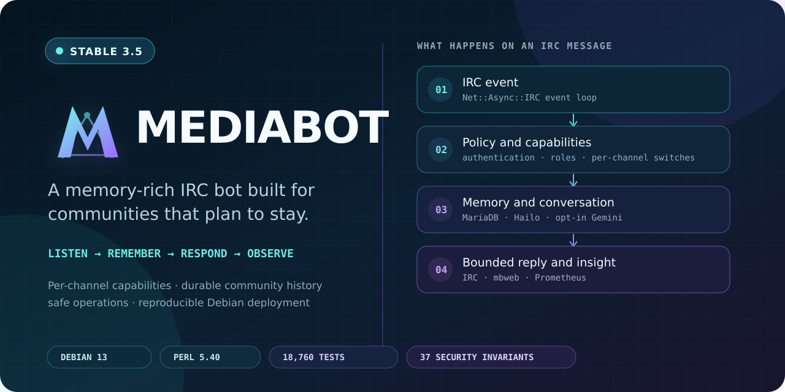
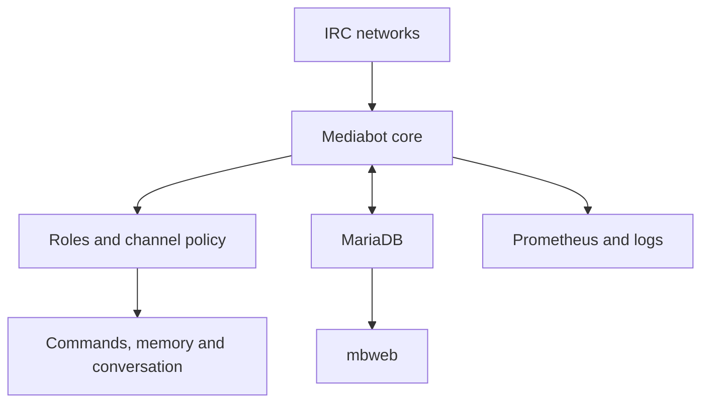

# Mediabot v3

> Developed with substantial help from large language models (LLMs). Apparently, that makes me a “lamer”. To be clear, I don’t consider anyone a “lamer” for building their projects the same way I do.

<p align="center">
  <a href="https://github.com/teuk/mediabot_v3/releases/tag/3.5">
    
  </a>
</p>

<p align="center">
  <a href="https://github.com/teuk/mediabot_v3/releases/tag/3.5"></a>
  <a href="https://github.com/teuk/mediabot_v3/actions/workflows/ci.yml"></a>
  <a href="https://github.com/teuk/mediabot_v3/actions/workflows/debian13.yml"></a>
  <a href="https://github.com/teuk/mediabot_v3/actions/workflows/debian13.yml"></a>
  <a href="LICENSE.md"></a>
  <a href="https://github.com/teuk/mediabot_v3/discussions"></a>
</p>

Mediabot helps IRC communities **run, remember and understand their channels**. It combines an event-driven IRC core, channel administration, persistent MariaDB-backed memory, community analytics, media integrations and production-oriented tooling.

<p align="center">
  <a href="https://github.com/teuk/mediabot_v3/releases/tag/3.5"><strong>Download stable 3.5</strong></a>
  ·
  <a href="https://github.com/teuk/mediabot_v3/wiki/Installation"><strong>Installation guide</strong></a>
  ·
  <a href="https://github.com/teuk/mediabot_v3/wiki/Command-reference"><strong>Command reference</strong></a>
  ·
  <a href="https://github.com/teuk/mediabot_v3/discussions"><strong>Ask a question</strong></a>
</p>

## What Mediabot provides

| Area | Capabilities |
| --- | --- |
| IRC runtime | `Net::Async::IRC`, reconnect handling, moderation, antiflood, URL/media enrichment and multi-network operation |
| Community memory | Seen history, quotes, factoids, karma, notes, reminders, achievements, milestones and channel analytics |
| Conversation | Per-channel Hailo brains and independently gated OpenAI, Claude and Gemini integrations |
| Administration | Global roles, numeric per-channel access, feature chansets and TCP/DCC Partyline |
| Operations | MariaDB schema validation, ordered migrations, systemd deployment, Doctor diagnostics, Prometheus metrics and structured logs |
| Optional services | mbweb console, read-only by default, and shared Icecast/Liquidsoap radio requests |

Features are enabled deliberately per channel. External work is bounded so it cannot silently become an unbounded IRC event-loop dependency.


```mermaid
flowchart TB
    IRC["IRC networks"] --> Core["Mediabot core"]
    Core --> Policy["Roles and channel policy"]
    Policy --> Features["Commands, memory and conversation"]
    Core <--> DB["MariaDB"]
    DB --> Web["mbweb"]
    Core --> Metrics["Prometheus and logs"]
```

## Release lines

| Line | Status | Recommended use |
| --- | --- | --- |
| **3.5** | Current stable release | Production installations from verified release artifacts |
| **3.6dev** | Current development line | Testing, contribution and evaluation of current development |

Stable and development installations should use separate directories, configurations, systemd instances, runtime files and IRC identities.

```text
3.5      current stable release
3.6dev   current development line
```

### Stable 3.5 release evidence

| Gate | Accepted result |
| --- | --- |
| Complete local suite | 927 files · 18,760 assertions passed |
| Cross-cutting audit | 37/37 fail-closed security invariants across 16 axes |
| Published source | Tagged commit `a55d030` with reproducible archives and SHA-256/SHA-512 manifests |

These are release-gate results for the tagged 3.5 source, not rolling coverage claims. See the [Mediabot 3.5 release notes](docs/RELEASE_NOTES_3.5.md) for the exact boundary.

## Quick installation on Debian 13

The complete procedure, including upgrades and optional services, is in the [Installation wiki page](https://github.com/teuk/mediabot_v3/wiki/Installation).

### 1. Install the base system

As `root`:

```bash
apt update
apt install -y \
  sudo \
  git \
  curl \
  wget \
  jq \
  unzip \
  zip \
  ca-certificates \
  perl \
  build-essential \
  make \
  gcc \
  pkg-config \
  mariadb-server \
  mariadb-client \
  libmariadb-dev

systemctl enable --now mariadb.service
adduser mediabot
```

`libmariadb-dev` provides the headers required to build `DBD::MariaDB`. `./configure` installs and verifies `DBI`, `DBD::MariaDB` and the remaining Perl modules through CPAN.

Do not install every optional integration by default. Chromium, Apache, Node.js, Prometheus, Icecast and Liquidsoap are needed only for the features that use them.

### 2. Create the dedicated account

Mediabot must not run as root. Continue the remaining installation as `mediabot`:

```bash
su - mediabot
```

### 3A. Install stable 3.5

Use this path for production. Download one published archive and both checksum manifests from the [3.5 release](https://github.com/teuk/mediabot_v3/releases/tag/3.5), then place them in `/home/mediabot`.

As `mediabot`, for the `.tar.gz` archive:

```bash
cd /home/mediabot || exit 1

grep 'mediabot_v3-3.5.tar.gz$' mediabot_v3-3.5-SHA256SUMS |
  sha256sum -c -
grep 'mediabot_v3-3.5.tar.gz$' mediabot_v3-3.5-SHA512SUMS |
  sha512sum -c -

tar -xzf mediabot_v3-3.5.tar.gz
mv mediabot_v3-3.5 mediabot_v3
cd /home/mediabot/mediabot_v3 || exit 1

test "$(tr -d '\n' < VERSION)" = '3.5'
```

For the `.tar.xz` archive, select its checksum lines and extract it with `tar -xJf`. Do not use GitHub's automatically generated source ZIP instead of the verified project release artifacts.

### 3B. Install 3.6dev

Use this path for development and testing:

```bash
cd /home/mediabot || exit 1
git clone https://github.com/teuk/mediabot_v3.git
cd /home/mediabot/mediabot_v3 || exit 1

git status --short
git branch --show-current
cat VERSION
grep -Eq '^3\.6dev-' VERSION
```

The default Git branch is the active development line, not a stable release.

### 4. Run `./configure`

For a fresh installation, use the supported wizard instead of manually copying the sample configuration:

```bash
cd /home/mediabot/mediabot_v3 || exit 1
./configure
```

The wizard generates `mediabot.conf`, installs and verifies Perl dependencies, creates the fresh database and application account, collects IRC/network settings and performs a final drift audit.

`mediabot.sample.conf` is a reference file. Do not copy it blindly over a generated or existing configuration.

Confirm that the resulting configuration is private:

```bash
chmod 600 mediabot.conf
vi mediabot.conf
stat -c '%U:%G %a %n' mediabot.conf
```

Expected:

```text
mediabot:mediabot 600 mediabot.conf
```

Never commit the real `mediabot.conf`. Passwords, IRC credentials, API keys, tokens, logs and runtime state also remain private.

### 5. Validate before the first start

```bash
perl tools/check_schema_drift.pl --conf=mediabot.conf --strict --types --indexes

perl -I. -c mediabot.pl
perl t/test_commands.pl --fast --progress
```

A non-zero strict schema result is an installation failure. Do not apply historical migrations to a fresh database.

### 6. Start in the foreground

```bash
perl mediabot.pl --conf=mediabot.conf
```

Check the application log first, normally `mediabot.log`. Once the bot is connected:

```text
!version
!uptime
!help
!features
```

Register the first Owner only in a private message:

```text
/msg BotNick register OwnerName StrongPassword
```

Then verify the recognized identity and channel access:

```text
!whoami
!access #channel
```

The documentation uses `!` consistently as its example IRC prefix. `MAIN_PROG_CMD_CHAR` can deliberately configure another prefix. Partyline commands retain their leading dot.

Do not switch to systemd until foreground startup is clean.

### 7. Install the systemd instance

Stop the foreground process cleanly, then install the published template and instance definition:

```bash
cd /home/mediabot/mediabot_v3 || exit 1

sudo ./install/systemd_install.sh \
  --instance prod \
  --bot-dir /home/mediabot/mediabot_v3

sudo systemd-analyze verify /etc/systemd/system/mediabot@.service
sudo systemctl enable mediabot@prod.service
sudo systemctl start mediabot@prod.service
sudo systemctl status mediabot@prod.service --no-pager -l
```

The installer never starts or enables the service implicitly. See [Running with systemd](https://github.com/teuk/mediabot_v3/wiki/Running-with-systemd) and [`tools/systemd/README.md`](tools/systemd/README.md) for multi-instance and replacement rules.

## Commands, access and chansets

Mediabot combines two authorization models:

- global account roles: Owner, Master, Administrator and User;
- numeric per-channel levels for channel-scoped administration.

Feature switches are stored per channel as **chansets**. A capability registered in `CHANSET_LIST` is not automatically enabled everywhere.

Useful discovery commands include:

```text
!help
!help commands
!help chansets
!showcommands #channel
!access #channel
!chanset #channel +Games
```

Documentation:

- [Complete command reference](https://github.com/teuk/mediabot_v3/wiki/Command-reference) — all 245 built-in command help entries;
- [Plugin architecture](docs/PLUGIN_ARCHITECTURE.md) — core boundaries, API v2 freeze and API v3 roadmap;
- [Playful v3 pilot](docs/PLAYFUL_V3_PILOT.md) — first reversible command migration, supervised rollout and rollback;
- [Quote Reads v3 pilot](docs/QUOTE_READ_V3_PILOT.md) — observe-first migration and exact rollback for the first database-backed commands;
- [Plugin API v3](docs/PLUGIN_API_V3.md) — strict packages, typed channel policy, versioned events, owned jobs, shared HTTPS/repository services and approved quote reads;
- [Short Content v3 pilot](docs/SHORT_CONTENT_V3_PILOT.md) — observe-first proof and rollback for the first external-content package;
- [Command catalogue](docs/COMMAND_CATALOGUE.md) — MB749 registry-native built-in dispatch and migration rollback rules;
- [Public commands](https://github.com/teuk/mediabot_v3/wiki/Public-commands);
- [Private and administrative commands](https://github.com/teuk/mediabot_v3/wiki/Private-and-admin-commands);
- [Access levels](https://github.com/teuk/mediabot_v3/wiki/Access-levels);
- [Chansets](https://github.com/teuk/mediabot_v3/wiki/Chansets).

Database-backed dynamic commands are instance data and therefore cannot be exhaustively listed in static project documentation.

## Optional services

Install optional components only after the IRC bot is healthy:

| Component | Documentation |
| --- | --- |
| mbweb web console | [mbweb console](https://github.com/teuk/mediabot_v3/wiki/Mbweb-console) and [`contrib/mbweb/README.md`](contrib/mbweb/README.md) |
| Shared radio requests | [Radio](https://github.com/teuk/mediabot_v3/wiki/Radio) and [`docs/RADIO.md`](docs/RADIO.md) |
| Prometheus and Grafana | [Monitoring guide](https://github.com/teuk/mediabot_v3/wiki/Monitoring-with-Prometheus-and-Grafana) |
| TCP/DCC Partyline | [Partyline guide](https://github.com/teuk/mediabot_v3/wiki/Partyline) |
| Plugins and external scripts | [Developing plugins](https://github.com/teuk/mediabot_v3/wiki/Developing-plugins) |

The shared radio service documented for current development belongs to the 3.6dev line. Stable operators should follow the documentation shipped with their selected release.

## Upgrading an existing instance

Fresh installation and upgrade are different operations. Never import `install/mediabot.sql` over an existing database.

Before an upgrade:

1. read the [release and upgrade notes](https://github.com/teuk/mediabot_v3/wiki/Release-and-upgrade-notes);
2. back up the database, private configuration and runtime state;
3. synchronize configuration with `./configure --config mediabot.conf --sync-only`;
4. review and apply only the required migrations in the authoritative order from `install/migrations/README.md`;
5. require strict schema, type and index validation before restart.

See [Database migrations](https://github.com/teuk/mediabot_v3/wiki/Database-migrations) for the complete fail-closed workflow.

Generate a reviewable, type- and index-aware migration plan before changing an existing database:

```bash
perl tools/check_schema_drift.pl --conf=mediabot.conf --generate-migration --types --indexes
```

The Debian 13 workflow builds and installs from the exact non-publishable rehearsal archive (or exact stable archive), verifies its manifests, runs in the official `debian:13-slim` container with system Perl 5.40, and confirms dependencies with `install/cpan_install.sh --verify-only`. It starts the Debian 13 MariaDB server, exercises `install/db_install.sh -c mediabot.conf`, then requires `check_schema_drift.pl --strict --types --indexes`.

The same disposable gate loads the real stable `3.3` database schema from the Git tag. Released migration files remain immutable; the gate applies only ordered newer migrations, proves exact rollback, and checks deterministic reapplication. The exact archive, rollback and reapplication evidence means the archive-derived disposable gate is the MB725 final technical install/upgrade proof.

The systemd installation helper is also exercised in an isolated root and its installed unit is parsed by `systemd-analyze verify`. Live systemd deployment and IRC connectivity remain MB722 operational checks, not container-CI claims.

## Development and tests

During development, run syntax checks, the smallest targeted regression and the fast lane:

```bash
perl -I. -c mediabot.pl
perl t/test_commands.pl --progress --filter '<relevant test or number>'
perl t/test_commands.pl --fast --progress
git diff --check
```

Run the complete suite once for the final pre-commit or release candidate:

```bash
perl t/test_commands.pl --progress
./t/full_test.sh -d /tmp/mediabot_tests
```

Further references:

- [Testing](https://github.com/teuk/mediabot_v3/wiki/Testing);
- [Contribution guidelines](CONTRIBUTING.md);
- [Complete changelog](CHANGELOG.md);
- [Achievement accuracy and channel timezones](docs/ACHIEVEMENTS.md);
- [3.5 release notes](docs/RELEASE_NOTES_3.5.md);
- [3.6dev development line](https://github.com/teuk/mediabot_v3/wiki/Development-line-3.6dev);
- [Partyline architecture](docs/PARTYLINE_ARCHITECTURE.md).

## Operations and troubleshooting

Start with the application log:

```bash
tail -n 200 /home/mediabot/mediabot_v3/mediabot.log
```

Use `systemctl status` and the journal primarily for service lifecycle and restart evidence. The read-only Doctor can inspect a configured instance, including the durable result of the last built-in updater run, without repairing or restarting it:

```bash
perl tools/mediabot_doctor.pl --conf=mediabot.conf
perl tools/mediabot_doctor.pl --conf=mediabot.conf --domain updater
```

`!update status` is local-only and reads `/home/mediabot/.mediabot_v3.update-status.json`; it does not contact GitHub or start an update.

See [Troubleshooting](https://github.com/teuk/mediabot_v3/wiki/Troubleshooting) for the evidence checklist and subsystem-specific routes.

## Security

- Never run Mediabot as `root`.
- Keep configuration and provider credentials outside Git.
- Bind local metrics and optional HTTP services to loopback unless a trusted authenticated proxy is used.
- Give mbweb a dedicated least-privileged database identity.
- Do not expose Liquidsoap control sockets to remote IRC clients.
- Report vulnerabilities privately according to the [security policy](.github/SECURITY.md).

## Community and support

- [Report a bug](https://github.com/teuk/mediabot_v3/issues/new?template=bug_report.md)
- [Request a feature](https://github.com/teuk/mediabot_v3/issues/new?template=feature_request.md)
- [GitHub Discussions](https://github.com/teuk/mediabot_v3/discussions)
- [Support guidelines](SUPPORT.md)
- [Code of Conduct](CODE_OF_CONDUCT.md)

Live IRC support is available on EpiKnet (`irc.epiknet.org`, TLS port `6697`) in `#i/o`.

## License

Mediabot v3 is free software licensed under the **GNU General Public License version 3 or later** (`GPL-3.0-or-later`). See [LICENSE.md](LICENSE.md).
